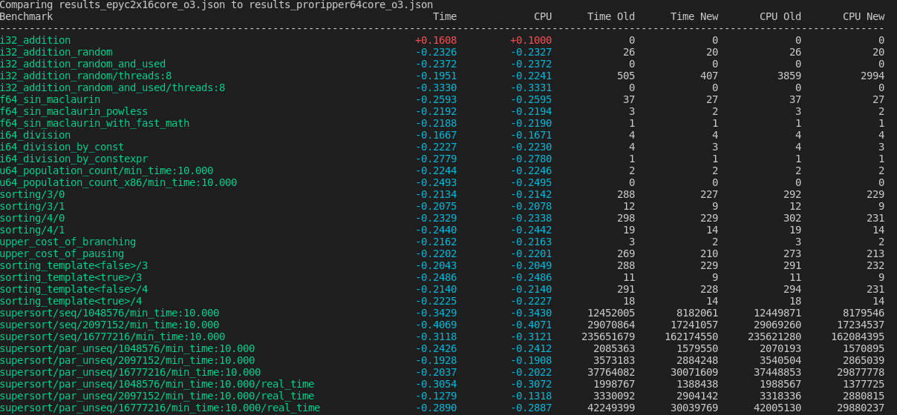

# C++ Benchmarking Tutorial

This repository is a practical example of common pitfalls in benchmarking high-performance applications.
If you are interested in more advanced benchmarks - check out the [unum-cloud/ParallelReductions](https://github.com/unum-cloud/ParallelReductions) and the two following articles:

* [879 GB/s Parallel Reductions in C++ & CUDA](https://unum.cloud/post/2022-01-28-reduce/).
* [Failing to Reach DDR4 Bandwidth](https://unum.cloud/post/2022-01-29-ddr4/).

Run it with a single-line command:

```sh
mkdir -p release && cd release && cmake .. && make && ./main ; cd ..
```

Dependencies will be fetched, but it's expected that you have a modern GCC compiler.
Some parts of the tutorial will not work on LLVM, MSVC, ICC, NVCC and other compilers.

## Lesser known GBench features

* [Random Interleaving](https://github.com/google/benchmark/blob/main/docs/random_interleaving.md) with `--benchmark_enable_random_interleaving=true`.
* [User-Requested Performance Counters](https://github.com/google/benchmark/blob/main/docs/perf_counters.md) via [`libpmf`](http://perfmon2.sourceforge.net/).
* [Comparing with previous results](https://github.com/google/benchmark/blob/main/docs/tools.md) with `compare.py`.

So running command changes to:

```sh
./release/main --benchmark_enable_random_interleaving=true --benchmark_format=json --benchmark_perf_counters="CYCLES,INSTRUCTIONS"
```

## Let's `compare.py` our results

We run the same script on 2 different same-generation CPUs from AMD.

* One configuration used 2x Epyc AMD EPYC 7302 16-Core CPUs.
* Second one used AMD Threadripper PRO 3995WX

In single-threaded workloads the 64-core variant was on average ~25% faster.



Now let's isolate `supersort` on the Threadripper.
Let's see the effect `-O3` optimizations level has over `-O1`.


Most notable, we have gained ~20% performance  in single-threaded sorting.

## Perf Results for `supersort`

```sh
sudo perf stat taskset 0xEFFFEFFFEFFFEFFFEFFFEFFFEFFFEFFF ./release/main --benchmark_enable_random_interleaving=true --benchmark_filter=supersort
```

The results on AMD Threadripper PRO 3995WX:

```sh
 Performance counter stats for 'taskset 0xEFFFEFFFEFFFEFFFEFFFEFFFEFFFEFFF ./release/main --benchmark_enable_random_interleaving=true --benchmark_filter=supersort':

       23048674.55 msec task-clock                #   35.901 CPUs utilized          
           6627669      context-switches          #    0.288 K/sec                  
             75843      cpu-migrations            #    0.003 K/sec                  
         119085703      page-faults               #    0.005 M/sec                  
    91429892293048      cycles                    #    3.967 GHz                      (83.33%)
    13895432483288      stalled-cycles-frontend   #   15.20% frontend cycles idle     (83.33%)
     3277370121317      stalled-cycles-backend    #    3.58% backend cycles idle      (83.33%)
    16689799241313      instructions              #    0.18  insn per cycle         
                                                  #    0.83  stalled cycles per insn  (83.33%)
     3413731599819      branches                  #  148.110 M/sec                    (83.33%)
       11861890556      branch-misses             #    0.35% of all branches          (83.34%)

     642.008618457 seconds time elapsed

   21779.611381000 seconds user
    1244.984080000 seconds sys
```
